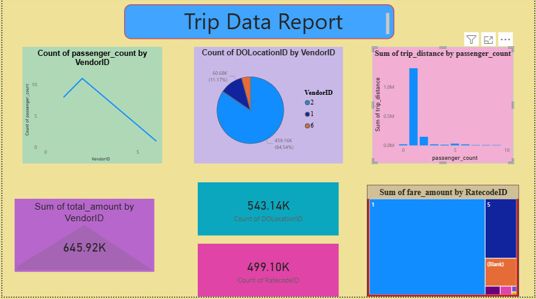

# NYC Taxi Data Engineering Pipeline

## Project Overview
This project demonstrates a complete **End-to-End Data Engineering Pipeline** using the NYC Taxi Public Dataset. The goal was to build a scalable Medallion Architecture (Bronze, Silver, Gold) to ingest, transform, and visualize large-scale trip data.

## Tech Stack
* **Orchestration**: Azure Data Factory (ADF)
* **Compute**: Azure Databricks (PySpark & Spark SQL)
* **Storage**: Azure Data Lake Storage (ADLS Gen2)
* **Governance**: Unity Catalog & Service Principals
* **Visualization**: Power BI

## Architecture & Workflow

### 1. Ingestion (Bronze Layer)
* Utilized **Azure Data Factory** to ingest raw Parquet files into the Bronze container of ADLS Gen2.
* Maintained raw data history for audit and reprocessing.

### 2. Transformation (Silver Layer)
* Developed **PySpark notebooks** in Databricks for data cleaning and schema enforcement.
* Optimized datasets by saving them as **Delta Tables**.

### 3. Aggregation (Gold Layer)
* Created business-level summaries (e.g., total trips, revenue per vendor) using **Spark SQL**.
* Prepared datasets for reporting and BI tools.

## Key Challenges & Solutions
* **Security Compliance**: Resolved GitHub push rejections by identifying and removing hardcoded secrets.
* **Governance**: Configured Unity Catalog with Service Principals for secure data access.
* **CI/CD**: Implemented version control using **ARM Templates** for ADF.

## **Data Visualization (Power BI)**
The final insights were visualized in Power BI Desktop. The dashboard includes metrics like:
* **Total Revenue per Vendor**
* **Trip Distance Analysis**
* **Passenger Count Distribution**

